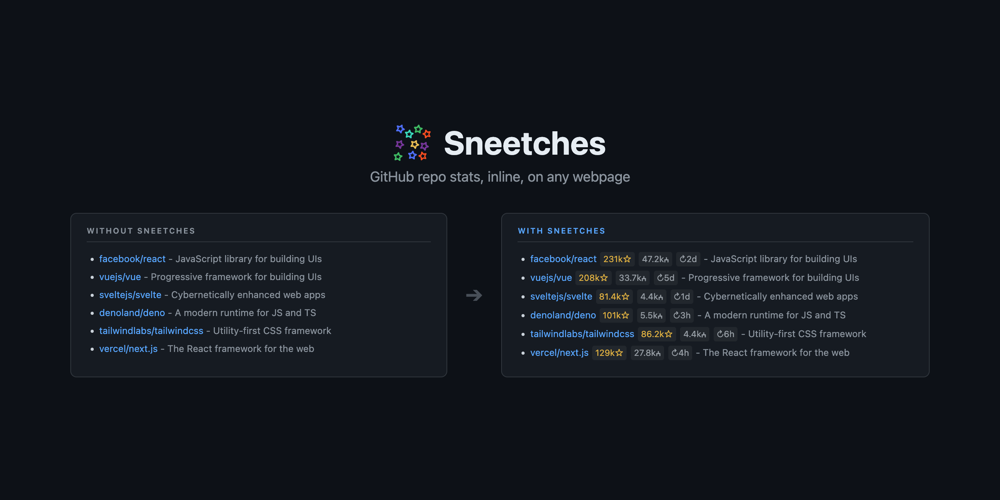

<p align="center">
  
</p>

<p align="center">
  <a href="https://chromewebstore.google.com/detail/sneetches-for-github/aajggmpgcfaphcealgonipamhklheikm">Chrome Web Store</a> · <a href="https://addons.mozilla.org/en-US/firefox/addon/sneetches-for-github/">Firefox Add-ons</a>
</p>

<p align="center">
  Originally created by <a href="https://github.com/osteele/sneetches">Oliver Steele</a>. Modernized and maintained by <a href="https://github.com/kesensoy">Kevin Esensoy</a>.
</p>

## Installation

Install from the [Chrome Web Store](https://chromewebstore.google.com/detail/sneetches-for-github/aajggmpgcfaphcealgonipamhklheikm) or [Firefox Add-ons](https://addons.mozilla.org/en-US/firefox/addon/sneetches-for-github/).

### From Source

1. **Prerequisites**: Node.js 20+ (fnm or nvm recommended)
   ```bash
   fnm use 20
   ```

2. **Build**:
   ```bash
   npm install
   npm run build
   ```

3. **Chrome**: Open `chrome://extensions/`, enable "Developer mode", click "Load unpacked", select `build/`.

4. **Firefox**:
   ```bash
   npm run build:firefox
   ```

### Settings

Sneetches uses the [GitHub API](https://developer.github.com/v3/) to retrieve repository metadata. It makes an API call for each repo link on a page and will quickly hit the [60 request/hour rate limit](https://developer.github.com/v3/#rate-limiting) for unauthenticated requests (displayed as an hourglass).

To increase this to 5,000 requests/hour, create a [GitHub Personal Access Token](https://github.com/settings/tokens/new) and paste it into the extension options. No scopes are required unless you want stats for private repos (add "repo" scope).

## Development

```bash
npm run dev          # Development build
npm run watch        # Development build with watch mode
npm test             # Run tests
npm run lint         # Lint
npm run check        # TypeScript type check
```

## Similar Projects

* [Github Hovercard](https://justineo.github.io/github-hovercard/) shows *more* information, on *hover* instead of inline.
* [Lovely Forks](https://github.com/musically-ut/lovely-forks) adds a guess at a project's active fork, beneath its name on the repo page.

## License

MIT - See [LICENSE](./LICENSE) for details.
