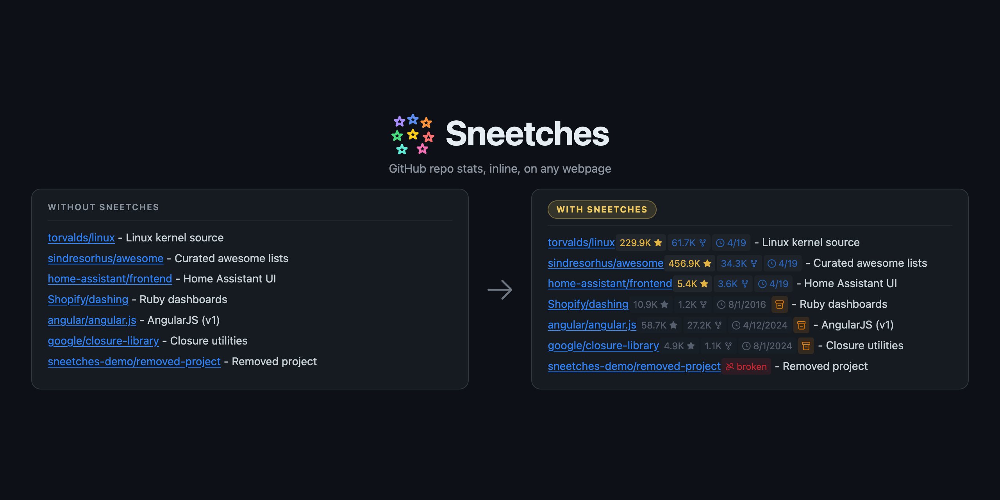
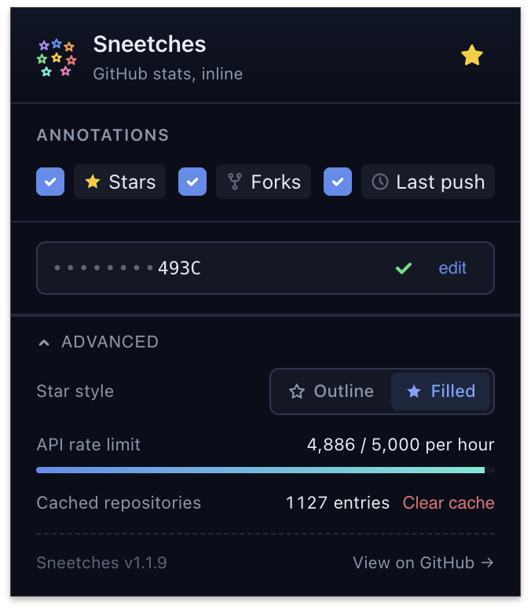

<p align="center">
  
</p>

<p align="center">
  <a href="https://chromewebstore.google.com/detail/sneetches-for-github/aajggmpgcfaphcealgonipamhklheikm">Chrome Web Store</a> · <a href="https://addons.mozilla.org/en-US/firefox/addon/sneetches-for-github/">Firefox Add-ons</a>
</p>

<p align="center">
  Originally created by <a href="https://github.com/osteele/sneetches">Oliver Steele</a>. Modernized and maintained by <a href="https://github.com/kesensoy">Kevin Esensoy</a>.
</p>

## Installation

Install from the [Chrome Web Store](https://chromewebstore.google.com/detail/sneetches-for-github/aajggmpgcfaphcealgonipamhklheikm) or [Firefox Add-ons](https://addons.mozilla.org/en-US/firefox/addon/sneetches-for-github/).

### From Source

1. **Prerequisites**: Node.js 20+ (fnm or nvm recommended)
   ```bash
   fnm use 20
   ```

2. **Build**:
   ```bash
   npm install
   npm run build
   ```

3. **Chrome**: Open `chrome://extensions/`, enable "Developer mode", click "Load unpacked", select `build/`.

4. **Firefox**:
   ```bash
   npm run build:firefox
   ```

## Settings

<p align="center">
  
</p>

Click the toolbar icon to open the popup — it's also the settings page. Toggle stars / forks / last push, pick an icon style, and (optionally) paste a [GitHub Personal Access Token](https://github.com/settings/tokens/new) to lift the API rate limit from 60 to 5,000 requests per hour. No scopes are required for public repos; add `repo` only if you want stats for your private ones. Current rate-limit usage and cached entry count are shown in the Advanced tray.

## Development

```bash
npm run dev          # Development build
npm run watch        # Development build with watch mode
npm test             # Run tests
npm run lint         # Lint
npm run check        # TypeScript type check
npm run format       # Format with Prettier
```

See [docs/CONTRIBUTING.md](./docs/CONTRIBUTING.md) and [PRIVACY.md](./PRIVACY.md).

## Similar Projects

* [Github Hovercard](https://justineo.github.io/github-hovercard/) shows *more* information, on *hover* instead of inline.
* [Lovely Forks](https://github.com/musically-ut/lovely-forks) adds a guess at a project's active fork, beneath its name on the repo page.

## License

MIT — see [LICENSE.txt](./LICENSE.txt) for details.
